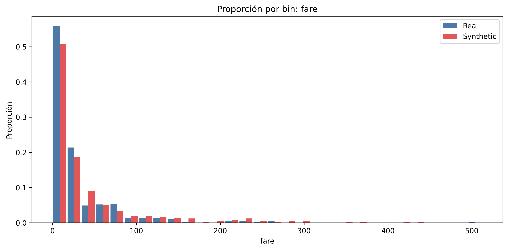
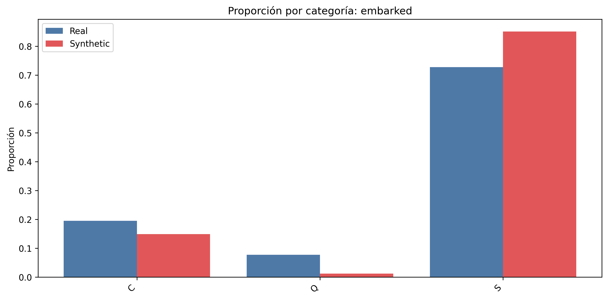

## Análisis de resultados y cómo interpretarlos

Este documento detalla, en tercera persona, cómo deben leerse los artefactos de `results/` y cómo se relacionan con el código que los produce. Cuando aparezcan términos técnicos, se incluirá entre paréntesis una aclaración breve.

### 1) Ubicación y propósito de cada salida

- `results/data/cleaned_dataset.csv`: dataset tras limpieza.
- `results/data/balanced_data.csv`: dataset balanceado por objetivo.
- `results/data/synthetic_data.csv`: datos sintéticos finales.
- `results/graphics/`: figuras PNG.
  - `original_dist.png` y `balanced_dist.png`: distribución del objetivo antes/después del balanceo.
  - `compare/compare_<col>.png`: comparativas Real vs Synthetic por columna.
  - `compare/compare_survived.png`: Real vs Balanced del objetivo.
- `results/reports/cleaning_report.json`: trazabilidad de limpieza.
- `results/reports/analysis_report.json`: resumen de análisis/balanceo.
- `results/reports/comparison_report.json`: métricas por variable.
- `results/reports/pipeline.log`: log integral del pipeline.

### 2) Balanceo del objetivo (analysis_report.json)

Fragmento del reporte (resumen estructurado en formato JSON):

```json
{
  "class_analysis": { "original_distribution": { "0.0": 549, "1.0": 342 } },
  "balancing": {
    "method": "RandomUnderSampler",
    "new_distribution": { "0.0": 342, "1.0": 342 }
  }
}
```

Correspondencia en código: el cálculo y el undersampling (submuestreo) ocurren en `analyze_data`.

```21:45:src/analysis/analyzer.py
class_dist = df[target_column].value_counts().to_dict()
undersampler = RandomUnderSampler(sampling_strategy="all", random_state=42)
X_res, y_res = undersampler.fit_resample(X, y)
```

Las figuras `graphics/original_dist.png` y `graphics/balanced_dist.png` se generan aquí:

```63:69:src/analysis/analyzer.py
def plot_class_distribution(series: pd.Series, filepath: str) -> None:
    plt.figure(figsize=(10, 6))
    sns.countplot(x=series)
    ...
```

Interpretación: el objetivo pasa de 61.6%/38.4% a 50%/50% usando submuestreo (submuestreo = reducir la clase mayoritaria hasta igualarla). La comparativa del objetivo se visualiza a continuación y se genera con la utilidad de barras unificada:


```306:317:src/analysis/analyzer.py
_plot_side_by_side_bars(..., left_label="Real", right_label="Balanced", ...)
```

### 3) Comparativas numéricas (comparison_report.json + figuras)

Para columnas numéricas, el reporte incluye medias, desviaciones y dos métricas de comparación:

- `rel_mean_diff = |mean_synth - mean_real| / (|mean_real| + 1e-8)` (diferencia relativa de la media)
- `std_rel_diff = |std_synth - std_real| / std_real` (diferencia relativa de la desviación estándar)

Ejemplo tomado del reporte:

```json
{
  "pclass": {
    "real_mean": 2.309,
    "synthetic_mean": 2.125,
    "rel_mean_diff": 0.079,
    "std_rel_diff": 0.005
  },
  "fare": {
    "real_mean": 32.204,
    "synthetic_mean": 31.033,
    "rel_mean_diff": 0.036,
    "std_rel_diff": 0.091
  },
  "age": {
    "real_mean": 29.362,
    "synthetic_mean": 35.593,
    "rel_mean_diff": 0.212,
    "std_rel_diff": 0.285
  }
}
```

Cómo se interpretan las figuras: ambas distribuciones se calculan sobre el mismo rango y con los mismos “bins” (bins = particiones del eje continuo) para que las alturas sean comparables. La barra azul corresponde al conjunto real y la roja al sintético.

```169:199:src/analysis/analyzer.py
vmin = float(min(real_vals.min(), syn_vals.min()))
vmax = float(max(real_vals.max(), syn_vals.max()))
real_counts, edges = np.histogram(real_vals, bins=bins, range=(vmin, vmax))
syn_counts, _ = np.histogram(syn_vals, bins=bins, range=(vmin, vmax))
```

Ejemplos visuales extraídos de `results/graphics/compare/`:

- Edad (`age`):


- Tarifa (`fare`):



La exportación de cada figura ocurre en archivos del tipo `compare_<col>.png`.

### 4) Comparativas categóricas (frecuencias alineadas)

Para columnas categóricas, se alinea el conjunto de categorías y, si los sintéticos están one‑hot, se agregan por prefijo.

```236:256:src/analysis/analyzer.py
prefix = f"{col}_"
oh_cols = [c for c in synthetic_df.columns if c.startswith(prefix)]
syn_counts = (synthetic_df[oh_cols].mean().rename(lambda x: x.replace(prefix, "")))
```

El reporte incluye proporciones por categoría y la figura correspondiente:

```241:281:src/analysis/analyzer.py
real_counts = real_df[col].astype(str).value_counts(normalize=True)
...  # alineación de categorías
_plot_side_by_side_bars(all_cats, real_heights, syn_heights, left_label="Real", right_label="Synthetic", ...)
```

Ejemplo del reporte para `sex` (proporciones por categoría):

```json
"sex": {
  "categories": ["female", "male"],
  "real_freq": {"female": 0.352, "male": 0.648},
  "synthetic_freq": {"female": 0.400, "male": 0.601}
}
```

Ejemplos visuales:




Interpretación de categóricas: cuando las barras del sintético se aproximan a las del real para cada categoría, la distribución sintética refleja adecuadamente la real. Diferencias grandes indican que el generador (generador = modelo que produce datos sintéticos) no capturó la frecuencia de esa categoría.

### 5) Log del pipeline y trazabilidad

El archivo `results/reports/pipeline.log` registra cada etapa y las advertencias de comparación, por ejemplo:

```text
2025-09-29 12:06:32 | WARNING | analysis | Alto drift en 'sibsp': rel_mean_diff=0.48, std_rel_diff=0.71
```

Estas líneas se originan en la validación posterior a calcular medias/desviaciones (desviación estándar = medida de dispersión):

```221:227:src/analysis/analyzer.py
if rel_mean_diff > drift_warn_threshold or std_ratio > drift_warn_threshold:
    logger.warning(...)
```

### 6) Conexión completa del flujo

El orquestador `src/pipeline/main.py` encadena limpieza, análisis, generación y comparación, dejando todos los artefactos en `results/`:

```151:170:src/pipeline/main.py
comparison_report = compare_real_vs_synthetic(...)
with open(os.path.join(REPORTS_DIR, "comparison_report.json"), "w", encoding="utf-8") as f:
    json.dump(comparison_report, f, indent=4, ensure_ascii=False)
```

Interpretación general de los resultados: valores bajos de `rel_mean_diff` y `std_rel_diff` (por ejemplo, por debajo de 0.3) sugieren buena fidelidad (fidelidad = similitud estadística entre real y sintético). En este conjunto, variables como `pclass` y `fare` muestran diferencias pequeñas, mientras que variables discretas de conteo como `sibsp` y `parch` presentan diferencias mayores. Las figuras adjuntas permiten confirmar visualmente estas conclusiones sin necesidad de navegar a la carpeta de resultados.
